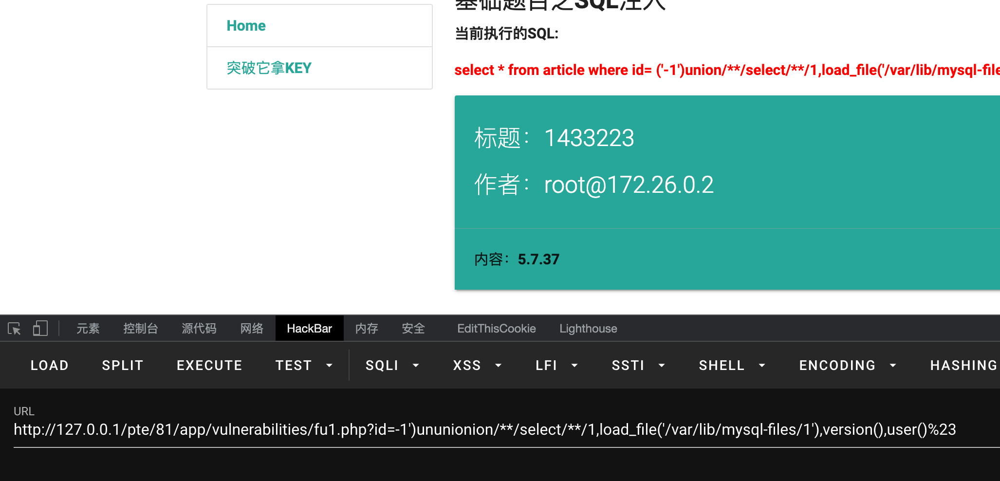
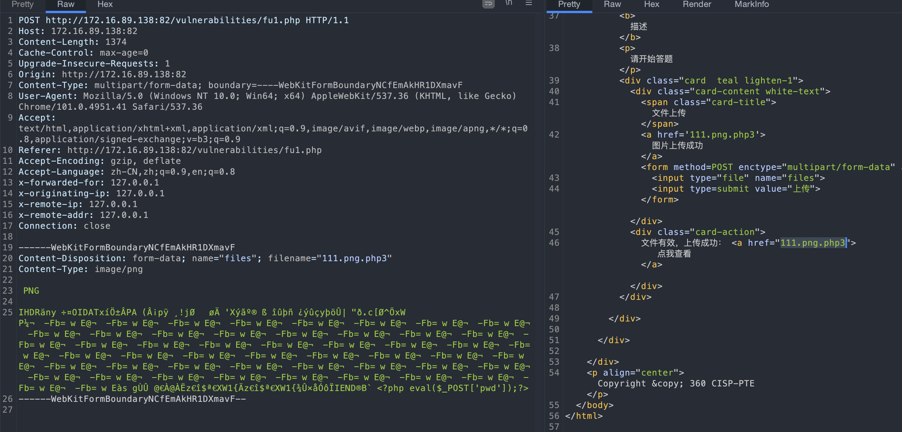
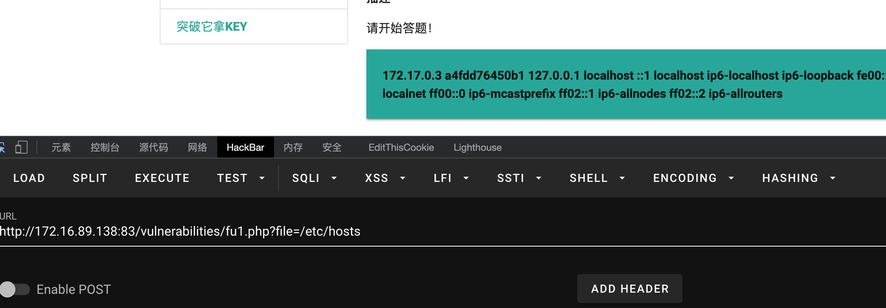

<br/>

# CISP-PTE

CISP-PTE 考试环境源码

## SQL注入

修改数据库账户密码，自行创建数据库

```sql
create database 2web;
use 2web;

create table article(id int(11) primary key,title varchar(255) null,content varchar(255) null,author varchar(255) null)character set utf8;

insert into article values( '1', 'SQL注入' , '所谓SQL注入，就是通过把SQL命令插入到Web表单提 交或输入域名或页面请求的查询字符串，最终达到欺骗服务器执行恶意的SQL命令', 'admin');
```


<br/>

## 文件上传

<br/>




<br/>

## 文件包含

<br/>



<br/>

<br/>

## 命令执行


<br/>

<br/>

## 日志分析

<br/>

<br/>


爆破

